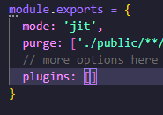
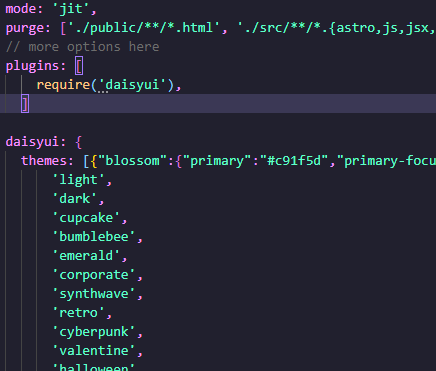

### Initialize the tailwind configuration so it is in a format thats usable by the other commands 

#### blossomplus init

Configures tailwind.config.(js|cjs) by making sure the daisyui plugin is installed, and then if needed inserts the daisyui config object. It then populates this object with all the default themes, and the daisyui ones too.

This bare structure turns into

#### Parameters: None

#### Flags: None